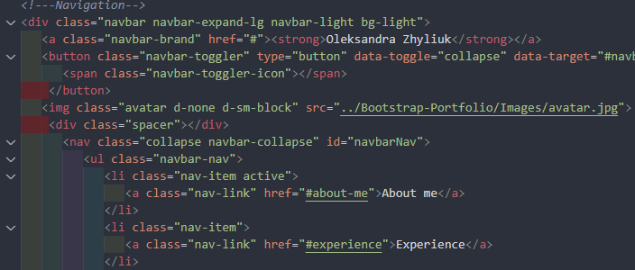
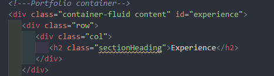
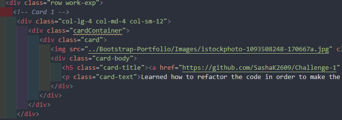
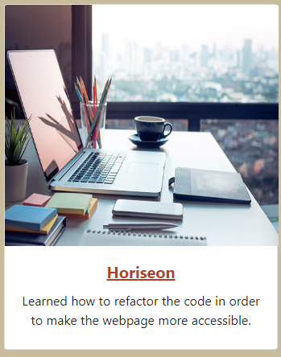
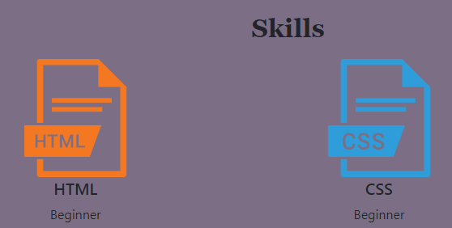
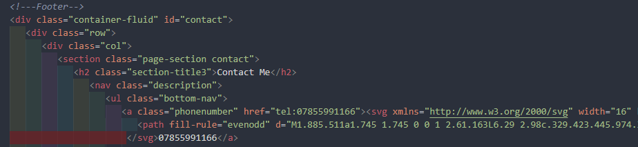

# Bootstrap-Portfolio
The Portfolio created using Bootatrap library.

## Description
The Bootstrap-Portfolio project was created by using Bootstrap libraries. The main idea of it was to learn how to use Bootstrap code tamplates and apply them into your personal code. In this project Bootstrap code templates were used for Navbar, Jumbotron, Cards and Grid. It actually saves time, when each and every code line has to be typed in manually. Instead you just have to correct the code due to your project's needs. It may be more obvious during bigger projects, not as this one.

### Instalation
N/A

### Usage
This Portfolio was created in HTML file with the help of Bootstrap and styled in CSS. Images and Fonts folder were added to the main repo as well. The Bootstrap was mainly used for Navigation section, Hero section, Experience and Skills sections and the Footer. Most of the sections are characterized by container or container-fluid class and a number of other classes, which are very importnat to make the code work. 

To be specific, Navbar component includes the name on the portfolio, avatar and a list of hyperlinks, which refer to each part of the page.

Hero section - Jumbotron - contains background image and a short about-me paragraph.

Experience section is a part of portfolio container and includes three Bootstrap cards. Each card contains an image, the name of the project, which is a hyperlink as well, and a description.

Skills section was created as a grid, containing 2 main parts: Soft and Hard skills. Each part has a cell with a skill information in it.

Footer has basic contacts and social media icons wrapped in hyperlinks.

Besides of the fact that Bootstrap has its own styling, some styles were added to CSS file so the project could be pleasant look at.

### Credits
N/A

### License
Please refer to the LICENSE in the repo.
